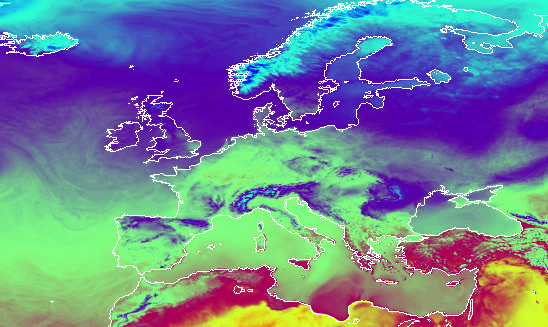

# IPM Decisions Weather Adapter for Deutsche Wetterdienst (DWD) covering all of EU
This software package builds a Docker image for a location based weather service that provides 30 hour weather forecasts from Deutsche Wetterdienst (DWD), covering all of EU, with a 7km resolution.



Example temperature map showing the covered area

[Information about DWD's Open Data Server](https://www.dwd.de/EN/ourservices/opendata/opendata.html)

Weather parameters returned

* Air temperature (&deg;C)
* Relative humidity (%)
* Rainfall (mm)
* Wind speed (m/s)

&copy; 2021 Met Norway and NIBIO 

Authors: Frank Thomas Tveter (Met Norway) and Tor-Einar Skog (NIBIO)

## License
```
 Copyright (c) 2021 NIBIO <https://www.nibio.no/> and Met Norway <https://www.met.no/>
 
 This program is free software: you can redistribute it and/or modify
 it under the terms of the GNU Affero General Public License as published by
 the Free Software Foundation, either version 3 of the License, or
 (at your option) any later version.
 
 This program is distributed in the hope that it will be useful,
 but WITHOUT ANY WARRANTY; without even the implied warranty of
 MERCHANTABILITY or FITNESS FOR A PARTICULAR PURPOSE.  See the
 GNU Affero General Public License for more details.
 
 You should have received a copy of the GNU Affero General Public License
 along with this program.  If not, see <http://www.gnu.org/licenses/>.
 
```

## Specifications
The build will clone the master branch of [NetCDF-Location-Weather-Adapter](https://github.com/H2020-IPM-Decisions/NetCDF-Location-Weather-Adapter)

## Building and running
``` bash
sudo docker build --tag ipmdecisions/weather_adapter_dwd-eu:ALPHA-01 .
sudo docker run -d --restart unless-stopped --publish 5001:80 -dt ipmdecisions/weather_adapter_dwd-eu:ALPHA-01
```
After you start the container, it will start downloading weather data from DWD. Expect 10-15 minutes to pass before the service is up and running.

Example request: `http://localhost:5001/?latitude=50.109&longitude=10.961`

Example reply: 

``` json
{
    "interval": 3600,
    "locationWeatherData": [
        {
            "QC": [
                1,
                1,
                1,
                1
            ],
            "altitude": null,
            "data": [
                [
                    15.166955566406273,
                    0.0,
                    46.03801727294922,
                    2.160727123686248
                ],
                [
                    16.852593994140648,
                    0.0,
                    41.84868240356445,
                    2.3403290259701914
                ],
                [
                    18.025170898437523,
                    0.0,
                    38.24155044555664,
                    2.36799481917794
                ],
                [
                    18.768640136718773,
                    0.0,
                    35.645668029785156,
                    2.4311879912561523
                ],
                [
                    19.240136718750023,
                    0.0,
                    33.44331359863281,
                    1.938408177320209
                ],
                [
                    19.215478515625023,
                    0.0,
                    32.87866973876953,
                    1.6777246406104023
                ],
                [
                    19.333001708984398,
                    0.0,
                    32.682777404785156,
                    1.7236668396959949
                ],
                [
                    19.012933349609398,
                    0.0,
                    33.347232818603516,
                    2.0412758693235507
                ],
                [
                    18.108819580078148,
                    0.0,
                    39.70045471191406,
                    1.526946969945744
                ],
                [
                    16.135278320312523,
                    0.0,
                    45.977596282958984,
                    1.4395298930883973
                ],
                [
                    13.821313476562523,
                    0.0,
                    51.05485534667969,
                    1.793505220625218
                ],
                [
                    13.019982910156273,
                    0.0,
                    50.16880798339844,
                    1.6186889460180982
                ],
                [
                    12.617883300781273,
                    0.0,
                    48.85804748535156,
                    1.8022301527717182
                ],
                [
                    12.797326660156273,
                    0.024016372859477997,
                    47.02772903442383,
                    1.7395851988030517
                ],
                [
                    12.335229492187523,
                    0.17877952009439468,
                    55.03487777709961,
                    2.0971639328941083
                ],
                [
                    12.292138671875023,
                    0.5338543951511383,
                    67.54908752441406,
                    2.933705415390992
                ],
                [
                    11.820336914062523,
                    0.7095643877983093,
                    77.16618347167969,
                    2.4551541628476996
                ],
                [
                    11.129663085937523,
                    0.20026540756225586,
                    86.19932556152344,
                    2.2733756250305204
                ],
                [
                    11.176721191406273,
                    0.0146026611328125,
                    89.2224349975586,
                    3.008000355588608
                ],
                [
                    11.241906738281273,
                    0.006371617317199707,
                    91.73783874511719,
                    3.5184033075696135
                ],
                [
                    11.318505859375023,
                    0.0002499818801879883,
                    90.09725952148438,
                    4.338954336530527
                ],
                [
                    11.497430419921898,
                    0.0,
                    81.78514862060547,
                    4.912911915678007
                ],
                [
                    12.116815185546898,
                    0.0,
                    76.57354736328125,
                    5.016228850429655
                ],
                [
                    13.090386962890648,
                    0.0,
                    68.95682525634766,
                    5.462901623100746
                ],
                [
                    14.334832763671898,
                    0.0,
                    62.079345703125,
                    5.922986733953229
                ],
                [
                    15.284570312500023,
                    0.0,
                    55.36906814575195,
                    5.813057493320903
                ],
                [
                    15.340722656250023,
                    0.004213929176330566,
                    52.54100036621094,
                    6.422172298186019
                ],
                [
                    15.754602050781273,
                    0.00318753719329834,
                    53.17461013793945,
                    6.215651156992316
                ],
                [
                    15.899316406250023,
                    0.0288543701171875,
                    49.54694747924805,
                    6.518278976495996
                ],
                [
                    16.079553222656273,
                    0.023927688598632812,
                    47.91836929321289,
                    6.551707084619721
                ],
                [
                    15.686730957031273,
                    null,
                    49.735862731933594,
                    6.08620043910091
                ]
            ],
            "latitude": "50.109",
            "longitude": "10.961"
        }
    ],
    "timeEnd": "2021-04-29T15:00:00Z",
    "timeStart": "2021-04-28T09:00:00Z",
    "weatherParameters": [
        1001,
        2001,
        3001,
        4012
    ]
}
```
